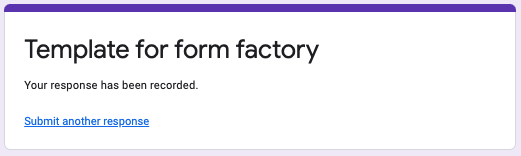

# ARCHIVED

An experiment in GSuite scripting. An attempt to create a scheduling form that is self-modifying. Did not work well.

# gsuite form factory

This GSuite script is intended to help ease the pain of creating forms for scheduling research participants.

## Driver setup (the easy way)

Clone [this](https://docs.google.com/spreadsheets/d/1j-5G9wIKaH29Wa676WEODVtUy35wcix6mLEQFmD6lqg/).

We are currently on version 0.0.1, last updated 20220413.

## Driver setup (the hard way)

A driver spreadsheet contains three values and a list.

1. Cell B1 is a URL to a Google Form that will be used as a template.
2. Cell B2 is the name of the form to be generated.
3. Cell B3 contains the text of the prompt for the selection of a participation slot.
4. Cells B4-> will are the multiple choice options.

An example driver sheet can be found [here](https://docs.google.com/spreadsheets/d/1j-5G9wIKaH29Wa676WEODVtUy35wcix6mLEQFmD6lqg/).

After creating the sheet, open the script editor and paste in the code from `form-factory.js`.

After adding the JS code, close the sheet and reopen it. 

## Using the "app"

### create a template

You will need to create a recruiting form template. In the GDrive folder where you want your recruiting actions to take place, create a new empty form. Make it look the way you want your final form to look. Your multiple choice options will be inserted at the bottom by the app, so you are templating "everything else."

### complete the driver sheet

The driver sheet looks like this:

Copy-paste the URL of your template into B1. Create a name for the form you will be generating, enter the title text of the multiple choice prompt, and your time selections. 

### run the form creation script

The `form-factory` script adds a menu to your driver sheet called `Form Factory`. Select `Create Form`.

### wait

Doesn't take long.

### behold, your new form!

You can now look in your GDrive folder and find a new form:

The newly created form is your template with the addition of a new multiple choice question. 

### send it to all the people

In the newly created form, do the usual things: get a share URL, change settings, etc. 

You can even edit this form, but it is probably a *very bad idea* to edit the multiple choices at this point. You would do better, always, to edit the template, edit the driver sheet, and generate a new form. (And, just trash the one you didn't like.)

So, you send it to all the people, and all the people reply, selecting when they would like to contribute to improving the user experience of government systems for *everyone*. 

In this case, someone decided they want to participate during "Sunday brunch." Remember this now.

### they complete the form

Such exciting. The people's experience with a GForm will be the same as their experience with every GForm.

### what happened!

The next person who comes to complete the form will see a new set of options.

The next person who comes to the form will only see the *remaining* options. Although many people **want** to take part in user studies during Sunday brunch, *there can be only one*. So, the next person who visits the form realizes they're going to have to choose a weekday, or possibly a Saturday.

(We don't typically ask users to take part in research studies during  Sunday brunch. This is entirely for comedic effect. Pretty good, eh? Government is a very funny place.)

### see your responses

Your responses are stored just like any other GForm. You can even ask for the newly created form to store them in a spreadsheet (as always).

### such spreadsheets

The resulting sheet, in this case, has the participant's email address and the timeslot they selected.

## what about PRA? PII?

You're a government researcher, and you know the rules and regulations under which you work. This document will not recount the rules and regulations regarding PII and PRA. If you collect *only* an email address and time, you are clear of PII considerations. PRA considerations are, oddly, more nuanced.

## what if I need support?

I would ask your friendly local software engineer. It is possible that Google will change things that break this script. 

## do I have permission to run this?

That's a great question. We're working on that.

## this was pretty funny!

I know, right? My 9yo told me a joke yesterday about koalas falling out of trees, but that will have to be for another time.

## can I use this for non-government work?

Of course! Generally speaking, the government cannot hold copyright. That means this, as a work of the US Gov't, is in the public domain (in the USA), and CC0 globally. 

### caveat or disclaimer of a sort

Note that this took about 4 hours to bring together. It is barely tested, but it solved an immediate need for a colleague, and will let us spend more time improving a mandated software system and less time chasing emails. Hopefully the code is instructive or useful to someone else. And, if not... it met our needs.
